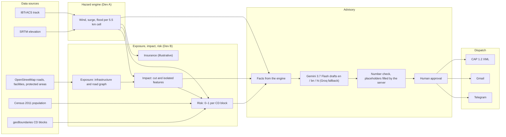

# Tempest

Anticipatory action for cyclones in South 24 Parganas, West Bengal: a replay of Cyclone Amphan
(May 2020) that shows, block by block and ahead of landfall, which roads and facilities the storm
will cut off, where risk concentrates, and drafts trilingual advisories that an official approves
before they are sent.

## The problem

South 24 Parganas lies on the Sundarbans delta, where Cyclone Amphan crossed the coast on
20 May 2020. Many of its villages, health centres and schools are reached by one road or a ferry,
so a storm cuts them off before it does anything else. District and block officials have to
decide in the day or two before landfall where to send boats, which patients to move and which
buildings to open as shelters, and they have to warn people in Bengali, English and Hindi. The
forecasts give wind and surge; what officials need is what those mean for their block's roads,
facilities and people, early enough to act.

## What Tempest does

Tempest replays Amphan over 25 timesteps, from 72 hours before landfall to landfall, in 3-hour
steps. At each step:

1. **Hazard:** wind, storm surge and flood susceptibility for each 5.5 km grid cell, from the
   IBTrACS track and SRTM elevation (Dev A's engine).
2. **Impact:** which roads, ferry routes and substations the hazard cuts, and which hospitals,
   health centres and shelters are isolated from the mainland road network.
3. **Risk:** a 0–1 score for each of the 29 CD blocks, from hazard, exposure (isolated
   facilities, cut roads and substations, population density) and vulnerability (hospital
   access), with the main driver for each block.
4. **Advisory:** blocks are suggested when their risk over the next 24 hours reaches 0.25 or a
   health facility or shelter in them is expected to be cut off within 24 hours (private and
   specialist facilities such as nursing homes and diagnostic centres don't count). For a
   block, a draft in English, Bengali and Hindi. The model writes the text with `{{placeholders}}`; the server fills every figure from the engine and
   rejects drafts that contain numbers of their own. A named official edits and approves it.
5. **Dispatch:** the approved advisory goes out by Telegram and Gmail, with a CAP 1.2 alert
   (status Exercise) validated against the OASIS schema.

A **Now / Next 24 h** switch runs impact and risk on the worst hazard of the next 24 hours, so
facilities show as expected to be cut off before the observed hazard cuts them off. Gosaba Rural
Hospital is first isolated at T-3 on the observed hazard and first expected-isolated at T-27,
24 h earlier; the first suggestion comes at T-42 (Namkhana, Frasergunj PHC expected to be cut off)
instead of T-18. An illustrative **parametric insurance** panel shows the payouts the hazard
readings would release per block.

## Architecture



The backend is a FastAPI service; the web app is a React map (MapLibre + deck.gl) with a side
panel. The contract between the hazard engine and the rest is
[shared/contracts.md](shared/contracts.md).

## Run it locally (DEMO_MODE)

DEMO_MODE is the default: every route is served from committed fixtures, with no API keys and no
external calls. You need Python 3.12 and Node.js 20.19+ or 22.13+ (Windows PowerShell shown).

```powershell
py -3.12 -m venv api\.venv
api\.venv\Scripts\python -m pip install -r api\requirements.txt
Copy-Item api\.env.example api\.env
api\.venv\Scripts\python -m uvicorn app.main:app --app-dir api
```

In a second terminal:

```powershell
cd web
npm install
npm run dev
```

Open <http://localhost:5173> and move the timeline. Advisories that have a cached draft open
without keys; generating a new one needs `GEMINI_API_KEY` in `api\.env`. Sending one needs the
dispatch settings described in `api\.env.example`.

Developer setup, tests and the data scripts: [docs/DEVELOPMENT.md](docs/DEVELOPMENT.md).
Deployment: [deploy.md](deploy.md).

## Tech stack

- **Backend:** Python 3.12, FastAPI, Pydantic, GeoPandas, Shapely, OSMnx, NetworkX, SQLite.
- **Models:** Gemini 3.7 Flash (google-genai), Groq `openai/gpt-oss-120b` as fallback;
  Google Earth Engine for the elevation sampling.
- **Frontend:** React 19, TypeScript, Vite, Tailwind CSS v4, MapLibre GL, deck.gl, d3-contour.
- **Dispatch:** Telegram Bot API, Gmail SMTP, CAP 1.2 (validated with xmlschema).
- **Deployment:** Docker on Render (API), Vercel (web app).

## About the data

The full list of sources, models and limits is in the app (side panel → About the data) and in
[web/src/features/about/sources.ts](web/src/features/about/sources.ts).

- **Real:** OpenStreetMap infrastructure and protected areas (downloaded 25 Sep 2026); the
  IBTrACS track for Cyclone Amphan; SRTM elevation (sampled at 90 m, averaged per 5.5 km cell);
  Census 2011 block population (via Wikidata, citing the Census PCA); geoBoundaries block
  boundaries.
- **Modelled:** wind (Holland profile with an outer envelope), storm surge (parametric), flood
  susceptibility, and impact and risk (Tempest's own engine).
- **AI:** advisories are drafted by Gemini 3.7 Flash (Groq as a labelled fallback); every figure
  comes from the engine, not the model; a named official approves every advisory.

## Limitations

- **Replay only.** The system runs on the 2020 Amphan replay; live mode is not implemented.
- **Coarse hazard grid.** Hazards are computed on 0.05° cells, about 5.5 km across.
- **Simplified coastline.** Distance to coast is measured to a straight line, not the real
  Sundarbans shoreline, and surge fades inland based on it.
- **Parametric surge.** Pressure drop plus wind set-up, decaying inland; not a hydrodynamic model.
- **Surge not validated.** Sentinel-1 radar on 22 May (~36 h after landfall) found 0.5–7.5 km² of
  standing water per coastal block, far less than modelled: much had drained, and radar can't see
  water under mangrove canopy.
- **Flood proxies.** 3 of the 6 flood susceptibility inputs (surface water, rainfall, land cover)
  are simplified proxies, not the JRC, IMERG or WorldCover datasets.
- **Perfect-forecast replay.** The "Next 24 h" view uses the replay's own next 24 hours (the worst
  case per cell), not a real forecast.
- **No designated shelters.** OpenStreetMap has none mapped here, so schools, community centres
  and public buildings are shown as stand-ins.
- **Health facilities** include nursing homes and small clinics, not only hospitals.
- **Insurance** figures are illustrative, not an actual policy, and follow the hazard reading,
  not assessed losses.
- **Literacy** is not used in the vulnerability score: the Census file with block literacy was
  unreachable.
